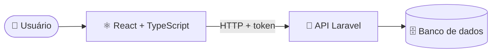

# 👋 Olá, eu sou o João Alexandre Kirst

### Desenvolvedor de Software · PHP & Laravel · JavaScript & React · Java · TOTVS Fluig

Construo sistemas web de ponta a ponta: API, banco de dados e interface.

---

## 🛠️ Tecnologias

**Backend**

**Frontend**

**Ferramentas**

Também trabalho com **TOTVS Fluig**.

## 🚗 Projeto em destaque: MyCar

Sistema de gestão para oficina mecânica, com clientes, veículos, ordens de serviço e manutenções.

| | Repositório | O que tem |
|---|---|---|
| 🐘 **API** | [mycar](https://github.com/joaoalexandre2/mycar) | Laravel 12, autenticação por token, CRUD completo, testes automatizados |
| ⚛️ **Frontend** | [mycar_frontend](https://github.com/joaoalexandre2/mycar_frontend) | React 19, TypeScript, Tailwind, rotas protegidas, paginação, testes com Vitest |

## 📌 Outros projetos

- 🏨 [backend-hotels-api](https://github.com/joaoalexandre2/backend-hotels-api): API em Java
- 🖥️ [admin-hotes](https://github.com/joaoalexandre2/admin-hotes): painel administrativo em TypeScript
- 📣 [canal-escuta](https://github.com/joaoalexandre2/canal-escuta): aplicação em PHP

## 📫 Contato

Veja meu portfólio em **[joaokirst.com.br](https://joaokirst.com.br/)**.

---

  
  

